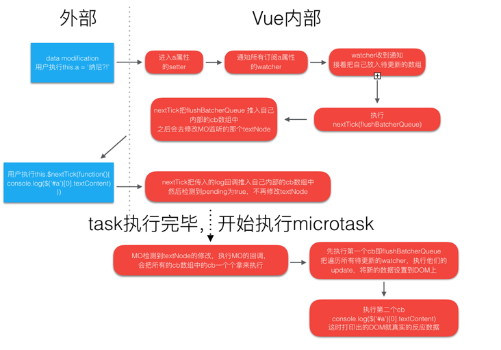

## MutationObserver

MO 是 HTML5 中的新 API，用来监听 DOM 变化的接口。它可以监听一个 DOM 对象上发生的属性修改、文本内容修改、子节点删除等等。

```javascript
// 选择需要观察变动的节点
const targetNode = document.getElementById("some-id");

// 观察器的配置（需要观察什么变动）
// 配置项：https://developer.mozilla.org/zh-CN/docs/Web/API/MutationObserverInit
const config = { attributes: true, childList: true, subtree: true };

// 当观察到变动时执行的回调函数
const callback = function (mutationsList, observer) {
  // Use traditional 'for loops' for IE 11
  for (let mutation of mutationsList) {
    if (mutation.type === "childList") {
      console.log("A child node has been added or removed.");
    } else if (mutation.type === "attributes") {
      console.log("The " + mutation.attributeName + " attribute was modified.");
    }
  }
};

// 创建一个观察器实例并传入回调函数
const observer = new MutationObserver(callback);

// 以上述配置开始观察目标节点
observer.observe(targetNode, config);

// 之后，可停止观察
observer.disconnect();
```

值得注意：**MutationObserver 的回调时放在 microtask 中执行的**

## Vue.nextTick

```javascript
export const nextTick = function () {
  var callbacks = [];
  var pending = false;
  var timeFunc;
  function nextTickHandler() {
    pending = false;
    /**
     * slice 复制一份是因为有的cb执行过程中又会往 callbacks 中加入内容
     * 比如 nextTick 的回调函数中又有 nextTick
     * 这些应该放入到下一轮的 nextTick 中执行，避免无休止的执行下去
     */
    var copies = callbacks.slice(0);
    callbacks = [];
    for (var i = 0; i < copies.length; i++) {
      copies[i]();
    }
  }

  /* istanbul ignore if */
  // ios9.3以上的 WebView 的 MutationObserver 有 bug
  // 在 hasMutationObserverBug 中存放了这种情况
  if (typeof MutationObserver !== "undefined" && !hasMutationObserverBug) {
    var counter = 1;
    // 创建一个MO
    var observer = new MutationObserver(nextTickHandler);
    var textNode = document.createTextNode(counter);
    // 调用 MutationObserver 的接口，观测文本节点的字符内容
    observer.observe(textNode, {
      characterData: true,
    });
    // 每次执行 timeFunc 都会让文本节点的内容在0/1之间切换
    timeFunc = function () {
      counter = (counter + 1) % 2;
      textNode.data = counter;
    };
  } else {
    // webpack 默认会在代码中插入 setImmediate 的垫片
    // 没有MutationObserver就优先用 setImmediate，不行再用 setTimeout
    const content = inBrowser
      ? window
      : typeof global !== "undefined"
      ? global
      : {};
    timeFunc = content.setImmediate || setTimeout;
  }

  return function (cb, ctx) {
    var func = ctx
      ? function () {
          cb.call(ctx);
        }
      : cb;
    callbacks.push(func);
    // 如果 pending 为 true，就其实表明本轮事件循环中已经执行过timerFunc(nextTickHandler, 0)
    if (pending) return;
    pending = true;
    // 触发监听执行回调，参数对 MO 没有效果
    // 在浏览器不支持 MO 的情况下回退到 setTimeout 时生效
    timeFunc(nextTickHandler, 0);
  };
};
```

Vue 在两个地方用到了上述 nextTick：

- Vue.nextTick 和 Vue.prototype.$nextTick 都是直接使用了这个 nextTick
- watcher 观测到数据变化后执行的是 nextTick(flushBatcherQueue)，flushBatcherQueue 则负责执行完成所有的 dom 更新操作。



从中：批处理更新是在 microtask 中执行的，而且用户在修改数据后自己执行的 nextTick(cb)也会在此时执行 cb，他们都是在同一个 microtask 中执行。

由此：Vue 不是想要 MO 来真正监听 DOM 更改，只是想要一个异步 API，用来在当前的同步代码执行完毕后，执行我想执行的异步回调。

## microtask

1. 一定要用 MutationObserver 吗？不
   - 只要是 microtask 都可以。最新的 Vue 源码里，优先使用的是 `Promise.resolve().then(nextTickHandler)`，没有原生 Promise 才用 MO。
2. 一定要 microtask？task 可以吗？不
   - microtask 可以保证当前 task 完成后立即执行 flushBatcherQueue（真正修改 DOM）完成，以及当前轮次的 microtask 全部清理完成时，执行 UI rendering，把重排重绘等操作真正更新到 DOM 上。
   - 如果是 task，那么会在当前的 task 和所有 microtask 执行完毕之后才在以后的某一次 task 执行过程中处理 flushBatcherQueue，但那时为时已晚，错过了多次触发重绘、渲染 UI 的时机。


