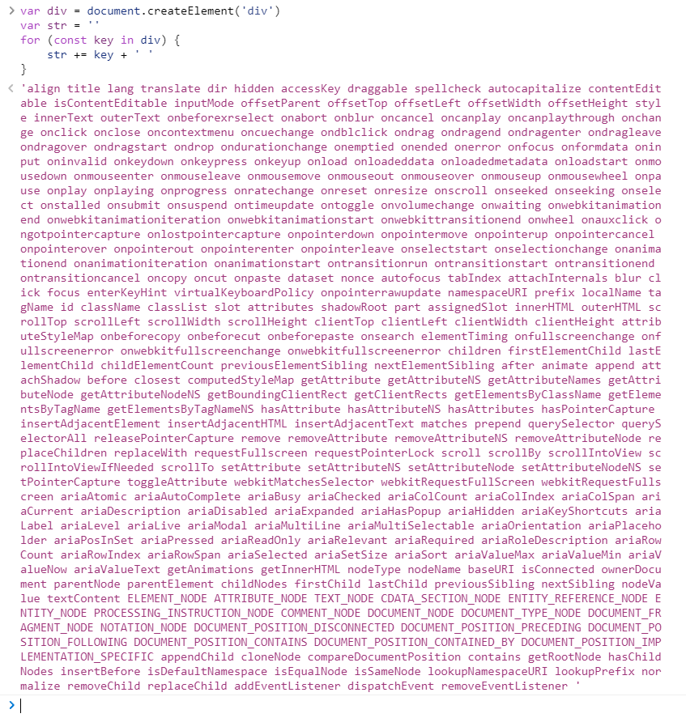

## vm.\_render

私有方法 `_render` 用来把实例渲染成一个虚拟 Node

> src/core/instance/render.js

```javascript
Vue.prototype._render = function () {
  const vm = this;
  const { render, _parentVnode } = vm.$options;

  // reset _rendered flag on slots for duplicate slot check

  if (_parentVnode) {
    vm.$scopedSlots = _parentVnode.data.scopedSlots || emptyObject;
  }

  vm.$vnode = _parentVnode;

  let vnode;
  try {
    // render 的第一个参数就是 createElement
    // vm.$createElement 在执行 initRender 方法时定义
    vnode = render.call(vm._renderProxy, vm.$createElement);
  } catch (e) {
    handleError(e, vm, `render`);

    // return error render result
    // or previous vnode to prevent render error causing blank component
  }

  // return empty vnode in case the render function errored out
  if (!(vnode instanceof VNode)) {
    // Array.isArray(VNode) 检查只能有一个根节点

    vnode = createEmptyVNode();
  }

  // set parent
  vnode.parent = _parentVnode;

  // 返回虚拟 Node
  return vnode;
};

// ① 那么 createElement 就是 vm.$createElement
export function initRender(vm) {
  // ...
  /**
   * bind the createElement fn to this instance
   * get proper render context inside it
   * @params: tag, data, children, normalizationType, alwaysNormalize
   */
  // internal version is used by render function compiled from templates
  // 为模板编译成的 render 函数所使用
  vm._c = (a, b, c, d) => createElement(vm, a, b, c, d, false);
  // public version: normalization is always applied, used in user-writen render functions
  // 为用户手写 render 方法所使用
  vm.$createElement = (a, b, c, d) => createElement(vm, a, b, c, d, true);
}
```

## Virtual DOM

浏览器中的 DOM 元素是非常庞大的，频繁的做 DOM 更新会产生一定的性能问题。



Virtual DOM 就是用一个原生的 JS 对象描述一个 DOM 节点。Vue 是用 VNode 这一 Class 去描述 Virtual DOM。

> src/core/vdom/vnode.js

```javascript
// 借鉴 snabbdom，加入 Vue 特色内容
export default class VNode {
  tag; // String
  data; // VNodeData
  children; // VNode[]
  text; // String
  elm; // Node
  ns; // String
  context; // Component // rendered in this component's scope
  key; // String | number
  componentOptions; // VNodeComponentOptions
  componentInstance; // VNodeComponentInstance // component instance
  parent; // VNode // component placeholder node

  // strictly internal
  raw; // Boolean - contains raw HTML? (server only)
  isStatic; // Boolean - hoisted static node
  isRootInsert; // Boolean - necessary for enter transition check
  isComment; // Boolean - empty comment placeholder?
  isCloned; // Boolean - is a cloned node?
  isOnce; // Boolean - is a v-once node?
  asyncFactory; // Function - async component factory function
  asyncMeta; // Object
  isAsyncPlaceholder; // Boolean
  ssrContext; // Object
  fnContext; // Component - real context vm for functional nodes
  fnOptions; // ComponentOptions - for SSR caching
  fnScopeId; // String - functional scope id support

  constructor(
    tag,
    data,
    children,
    text,
    elm,
    context,
    componentOptions,
    asyncFactory
  ) {
    // ...
  }

  get child() {
    return this.componentInstance;
  }
}
```

## createElement

> src/core/vdom/create-element.js

```javascript
// wrapper function for providing a more flexible interface without getting yelled at by flow
// 允许传入的参数更加灵活，处理后调用真正创建 VNode 的 _createElement
export function createElement(
  context, // Component
  tag, // any
  data, // any
  children, // any
  normalizationType, // any
  alwaysNormalize // Boolean
) {
  if (Array.isArray(data) || isPrimitive(data)) {
    normalizationType = children;
    children = data;
    data = undefined;
  }
  if (isTrue(alwaysNormalize)) {
    normalizationType = ALWAYS_NORMALZE;
  }

  return _createElement(context, tag, data, children, normalizationType);
}

export function _createElement(
  context, // Component - 上下文环境
  tag, // String | Class<Component> | Function | Object - 标签
  data, // VNodeData - 数据（flow/vnode.js）
  children, // any - 子节点
  normalizationType // number - 子节点规范（编译/用户）
) {
  if (isDef(data) && isDef(data.__ob__)) {
    // 传递了data，且已经 observed，绑定了 Observer
    return createEmptyVNode();
  }

  // object syntax in v-bind
  if (isDef(data) && isDef(data.is)) {
    tag = data.is;
  }

  if (!tag) {
    // in case of component :is set to falsy value
    return createEmptyVNode();
  }

  // warn against non-promitive key

  // support single function children as default scoped slot
  if (Array.isArray(children) && typeof children[0] === "function") {
    data = data || {};
    data.scopedSlots = { default: children[0] };
    children.length = 0;
  }
  if (normalizationType === ALWAYS_NORMALIZE) {
    children = normalizeChildren(children);
  } else if (normalizationType === SIMPLE_NORMALIZE) {
    children = simpleNormalizeChildren(children);
  }

  let vnode, ns;
  if (typeof tag === "string") {
    let Ctor;
    ns = (context.$vnode && context.$vnode.ns) || config.getTagNamespace(tag);
    if (config.isReserveTag(tag)) {
      // platform built-in elements
      vnode = new VNode(
        config.parsePlatformTagName(tag),
        data,
        children,
        undefined,
        undefined,
        context
      );
    } else if (
      isDef((Ctor = resolveAsset(context.$options, "components", tag)))
    ) {
      // component
      vnode = createComponent(Ctor, data, context, children, tag);
    } else {
      // unknown or unlisted namespaced elements
      vnode = new VNode(tag, data, children, undefined, undefined, context);
    }
  } else {
    // direct component options / constructor
    vnode = createComponent(tag, data, context, children);
  }
  if (Array.isArray(vnode)) {
    return vnode;
  } else if (isDef(vnode)) {
    if (isDef(ns)) applyNS(vnode, ns);
    if (isDef(data)) registerDeepBindings(data);
    return vnode;
  } else {
    return createEmptyVNode();
  }
}
```
